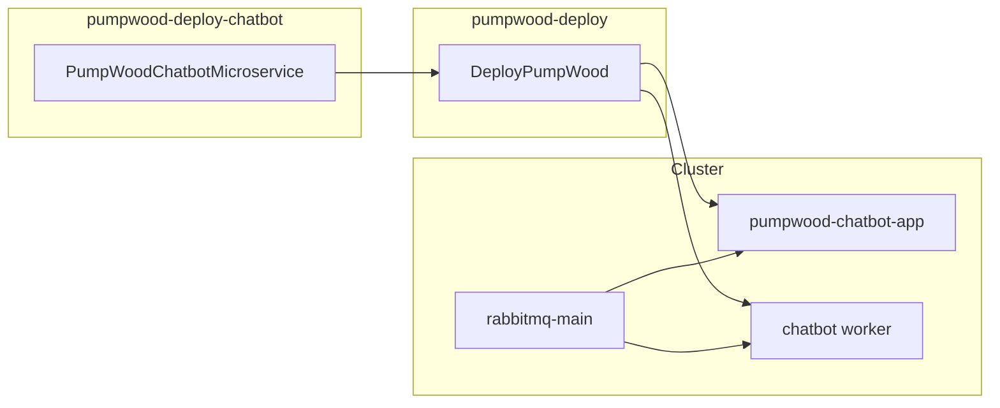

# pumpwood-deploy-chatbot

Satellite deploy package for the **Pumpwood Chatbot** microservice on
Kubernetes. It generates manifests for the API application, one chatbot
worker, and chatbot secrets — then hands them to
[`pumpwood-deploy`](https://github.com/Murabei-OpenSource-Codes/pumpwood-deploy)
for apply.

Developed by [Murabei Data Science](https://murabei.com). BSD-3-Clause.

## Objective and motivation

This package deploys the Pumpwood Chatbot HTTP API and its RabbitMQ
worker onto a Kubernetes cluster using `DeployPumpWood`.

### Why this exists
Chatbot was added to local docker-compose as
`pumpwood-chatbot-app` and `pumpwood-chatbot-worker`. Cluster deploy
needs the same satellite pattern used by model-llm and datalake.

### How it is used
A deploy script constructs `PumpWoodChatbotMicroservice`, registers it
with `DeployPumpWood.add_microservice`, then generates and applies
manifests. Operators pin image tags via environment variables.

### Scope
This package owns chatbot app, worker, and secret YAML. Postgres,
PgBouncer, storage, Kong, and RabbitMQ come from `pumpwood-deploy`.

---

## What it deploys

| Manifest | Kubernetes resources |
|----------|----------------------|
| `pumpwood_chatbot__secrets` | Secret `pumpwood-chatbot-secrets` |
| `pumpwood_chatbot__deploy` | Deployment + Service `pumpwood-chatbot-app` |
| `pumpwood_chatbot__worker` | Deployment `pumpwood-chatbot-worker` |

Chatbot exposes HTTP APIs for conversational workflows. The worker
consumes RabbitMQ messages for chatbot background tasks.



---

## Prerequisites

This package does **not** stand alone. Before chatbot pods can start,
the cluster must already provide:

| Resource | Provided by |
|----------|-------------|
| `storage` ConfigMap | `StandardMicroservices` in `pumpwood-deploy` |
| `general-secrets` | `StandardMicroservices` |
| `rabbitmq-main-secrets` | `StandardMicroservices` |
| Storage keys (GCP / Azure / AWS) | `DeployPumpWood` storage config |
| Postgres for chatbot | `PostgresDatabase` + `PGBouncerDatabase` |
| Auth (typical) | [`pumpwood-deploy-auth`](https://github.com/Murabei-OpenSource-Codes/pumpwood-deploy-auth) |

Storage bucket name and type are read from the cluster `storage`
ConfigMap — they are **not** passed to `PumpWoodChatbotMicroservice`.

---

## Installation

```bash
pip install pumpwood-deploy-chatbot
```

Requires `pumpwood-deploy`.

---

## Quick start

```python
import os
import simplejson as json
from dotenv import load_dotenv
from pumpwood_deploy.deploy import DeployPumpWood
from pumpwood_deploy.microservices.postgres.deploy import (
    PostgresDatabase, PGBouncerDatabase)
from pumpwood_deploy_chatbot import PumpWoodChatbotMicroservice

with open("secrets/production.json", "r") as file:
    secrets = json.loads(file.read())
load_dotenv()

deploy = DeployPumpWood(
    model_user_password=secrets["microservices--model"],
    rabbitmq_secret=secrets["rabbitmq_secret"],
    hash_salt=secrets["hash_salt"],
    storage_type="aws_s3",
    storage_deploy_args={
        "storage_bucket_name": "my-pumpwood-bucket",
        "access_key_id": secrets["aws_access_key_id"],
        "secret_access_key": secrets["aws_secret_access_key"],
    },
    k8_provider="aws",
    k8_deploy_args={
        "region": "us-east-1",
        "cluster_name": "my-cluster",
    },
    k8_namespace="pumpwood",
)

deploy.add_microservice(
    PostgresDatabase(
        db_username="pumpwood",
        db_password=secrets["postgres_password"],
        name="postgres-main",
        disk_name="postgres-disk",
        disk_size="150Gi",
    ))

deploy.add_microservice(
    PGBouncerDatabase(
        name="pgbouncer-pumpwood-chatbot",
        postgres_database="pumpwood_chatbot",
        postgres_secret="postgres-main",
        postgres_host="postgres-main",
    ))

deploy.add_microservice(
    PumpWoodChatbotMicroservice(
        app_version=os.getenv("PUMPWOOD_CHATBOT_APP"),
        worker_version=os.getenv("PUMPWOOD_CHATBOT_WORKER"),
        repository="my-registry.example.com",
        db_host="pgbouncer-pumpwood-chatbot",
        db_database="pumpwood_chatbot",
        db_password=secrets["postgres_password"],
        microservice_password=secrets["microservice--chatbot"],
        api_key=secrets["openai_api_key"],
    ))

deploy.create_deploy_files()
deploy.deploy_microservices()
```

### Environment variables

```bash
PUMPWOOD_CHATBOT_APP=0.0.16
PUMPWOOD_CHATBOT_WORKER=0.0.6
```

If the rendered manifest matches what is already on the cluster,
`kubectl apply` produces no changes — safe for rolling image updates.

---

## Configuration reference

### Required

| Parameter | Description |
|-----------|-------------|
| `app_version` | Image tag for `pumpwood-chatbot-app` |
| `worker_version` | Image tag for `pumpwood-chatbot-worker` |
| `api_key` | OpenAI key; worker env `OPENAI_API_KEY` |

### Database

| Parameter | Default | Description |
|-----------|---------|-------------|
| `db_host` | `pgbouncer-pumpwood-chatbot` | Postgres host |
| `db_port` | `5432` | Postgres port |
| `db_database` | `pumpwood` | Database name |
| `db_username` | `pumpwood` | Database user |
| `db_password` | `pumpwood` | Database password |
| `microservice_password` | `microservice--chatbot` | Service user password |
| `repository` | GCR default | Docker registry |

### Application

| Parameter | Default | Description |
|-----------|---------|-------------|
| `app_replicas` | `1` | App pod count |
| `app_debug` | `FALSE` | Debug flag |
| `app_workers` | `10` | Granian workers |
| `app_timeout` | `300` | Request timeout (seconds) |
| `app_limits_memory` | `60Gi` | Memory limit |
| `app_limits_cpu` | `12000m` | CPU limit |

The worker supports `debug`, `replicas`, `n_parallel`, `chunk_size`,
`query_limit`, and resource limit/request parameters with defaults
matching the model-llm worker pattern.

---

## Health check

The app Deployment exposes a readiness probe at:

```
GET /health-check/pumpwood-chatbot-app/  (port 5000)
```

---

## Related packages

| Package | Role |
|---------|------|
| [`pumpwood-deploy`](https://github.com/Murabei-OpenSource-Codes/pumpwood-deploy) | Orchestrator, Kong, RabbitMQ, Postgres |
| [`pumpwood-deploy-auth`](https://github.com/Murabei-OpenSource-Codes/pumpwood-deploy-auth) | Authorization microservice |
| [`pumpwood-deploy-model-llm`](https://github.com/Murabei-OpenSource-Codes/pumpwood-deploy-model-llm) | Model LLM microservice |

---

## Development

```bash
pip install -e ../pumpwood-deploy
pip install -e .

PYTHONPATH="src:../pumpwood-deploy/src" \
  python3 -m unittest discover \
  -s src/pumpwood_deploy_chatbot/tests -p "test_*.py" -v

ruff check src/
```

---

## License

BSD-3-Clause — see [LICENSE](LICENSE).
